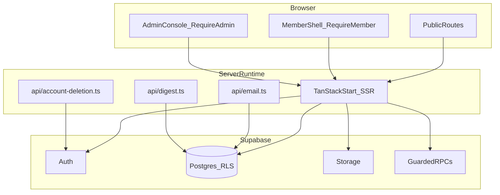

# Architecture

Status: active-product architecture reference. **Canonical context:** [PROJECT_MEMORY.md](./PROJECT_MEMORY.md). Updated 2026-07-18 (through phase32).

## Architecture map

## Layer reference

| Layer          | Paths                                                  | Detail doc                                             |
| -------------- | ------------------------------------------------------ | ------------------------------------------------------ |
| Public site    | `src/routes/index.tsx`, labs, apply, evidence          | [PRODUCT_SPEC.md](./PRODUCT_SPEC.md)                   |
| Member portal  | `src/routes/dashboard.tsx`, projects, papers, research | [USER_FLOW_MAP.md](./USER_FLOW_MAP.md)                 |
| Project engine | `src/lib/projects.ts`, `project-collaboration.ts`      | [DATA_MODEL.md](./DATA_MODEL.md)                       |
| Admin          | `src/routes/admin/`, `src/components/admin/*`          | [SYSTEM_MAP.md](./SYSTEM_MAP.md)                       |
| Security       | `src/lib/security.ts`, `supabase/phase*.sql`           | [SECURITY_REVIEW.md](./SECURITY_REVIEW.md)             |
| Release        | `scripts/release-readiness.mjs`                        | [LAST_KNOWN_GOOD_STATE.md](./LAST_KNOWN_GOOD_STATE.md) |
| Portfolio QA   | `scripts/portfolio-preflight.mjs`                      | [EVIDENCE.md](./EVIDENCE.md)                           |

## Stack

- App: TanStack Start, React 19, TypeScript, TanStack Router, TanStack Query,
  Tailwind, Radix/shadcn UI primitives, Vite.
- Backend: Supabase Auth, Postgres, Row Level Security, Storage, and SQL RPCs.
- Runtime APIs: Vercel/Cloudflare-compatible handlers for email, digest, and
  account deletion.
- Tooling: Bun scripts, TypeScript, ESLint, Bun tests, route smoke script,
  Supabase verification scripts, release readiness script, Vercel and Cloudflare
  configs.

## Product Areas

- Public site: institutional positioning, public research/content, public
  evidence, legal pages, and conversion to membership.
- Member shell: dashboard, search, saved items, applications, notifications,
  profile, account settings, and learning/research work.
- Project workspaces: lead-created projects, applications, collaboration,
  contribution evidence, assigned reviewers, updates, and governed publication.
- Admin console: publishable content, members, claims, moderation, reports,
  audit/security, programmes, papers, projects, jobs, guides, events, and bulk
  operations.

## Data And Security Boundary

The browser handles interaction and optimistic state only. Supabase RLS, SQL
functions, and server/API handlers must enforce identity, ownership, roles,
publication state, application windows, evidence review (lead/admin or assigned
reviewer), and destructive account operations.

Local seed fallbacks are development-only. Production must use live Supabase
data and real empty states when records do not exist.

## Schema chain

Migrations live under `supabase/schema.sql` + `phase2.sql` … `phase27.sql`,
bundled as `FINAL_SETUP.sql`. Notable late phases: phase26 (research paths,
datasets, public papers catalog), phase27 (assigned contribution reviewers).

## Deployment Boundary

The same source can deploy through Vercel or Cloudflare, but production requires
one canonical deployment target, one canonical domain, one Supabase project, and
server-only secrets configured outside the client bundle.

## Portfolio preflight boundary

`scripts/portfolio-preflight.mjs` is an executable audit layer around the
BU1LD-centered workspace. It reads `research/PROJECT_REGISTRY.yaml`, inspects
configured repository roots, and writes JSON/Markdown evidence to
`research/preflight/`. It is intentionally local and non-destructive: it does not
install dependencies, run migrations, read `.env` values, deploy code, or mutate
other repositories. Its job is to catch stale registry claims, dirty worktrees,
missing release commands, migration gaps, placeholder/source risks, secret-like
literals, broken local documentation links, and evidence-level blockers before a
human calls a product or research project release-ready.
